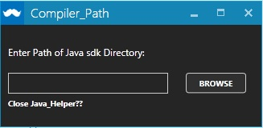
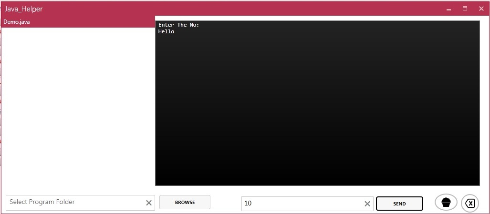

# Java_Helper
Java_Helper
<h2> Usage: 

 <h4> For Above Window Give jdk path by default it is "c:\Programs Files\Java\Jdkx_x_x\bin"

<h4>Give Folder Path Which Contains Java Programs By Clicling On Browse Button on left side of Main Window..
<h4>Then Java files Will apeared on Left Side As Shown In Above Pic Then Select file to Compile and Run 
<h4> and click on Cupcake..
<h4>for Sending Input GIve The input in Input Box and click Send...

<h3>Known Bugs:-
*Force Stops when Clicking on console window.
*Force Stops when Clicking on Run button when Application is alread busy in eexecuting java programs      
