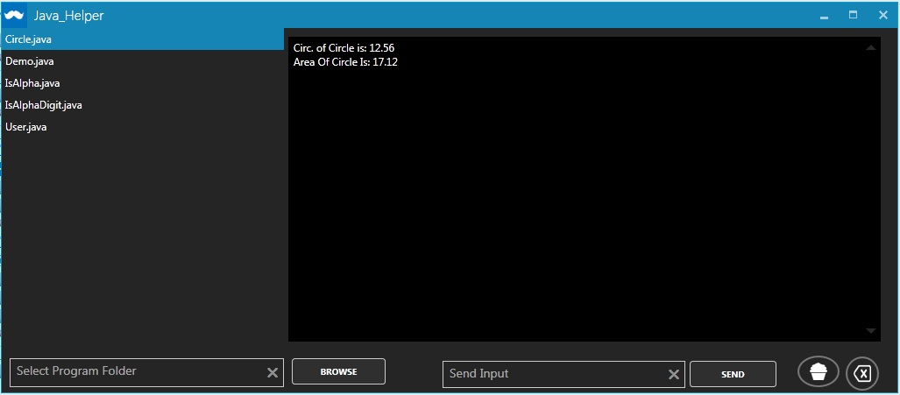

# Java_Helper
Simple tool For java programs to run and execute. 
<h2> Usage: </h2>

 <h4> For Above Window Give jdk path by default it is "c:\Programs Files\Java\Jdkx_x_x\bin"</h4>

<h4>Give Folder Path Which Contains Java Programs By Clicling On Browse Button on left side of Main Window..
    Then Java files Will apeared on Left Side As Shown In Above Pic Then Select file to Compile and Run 
    and click on Cupcake..
    for Sending Input GIve The input in Input Box and click Send...</h4>

<h3>Known Bugs:</h3>
  <h4>  * No More Bugs!!</h4>
* ~~-Force Stops when Clicking on console window.~~ 
* ~~Force Stops when Clicking on Run button when Application is alread busy in executing java programs.~~ 
